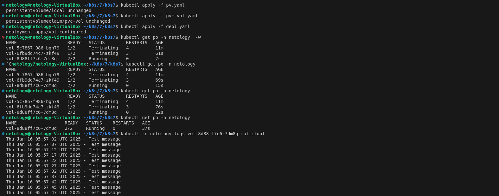

### 1

pv в статусе Released - с удалением pvc разорвалась связь, pv остался в ожидании следующео запроса.

фл остался на ноде после удаления pv persistentVolumeReclaimPolicy - если не указана, то по умолчанию оставляет файлы.

### 2 

